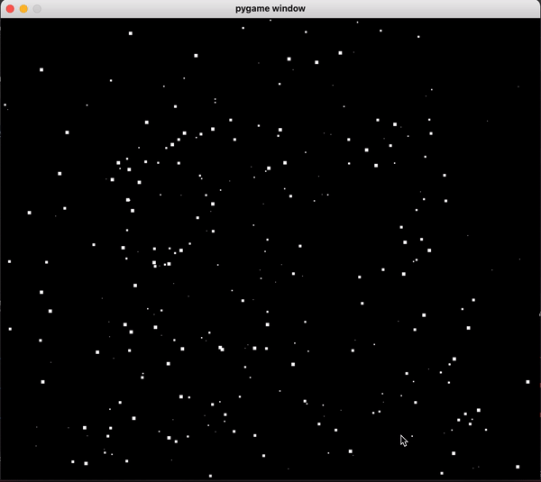

# python_gravity_simulation_pygame
A simple implementation which simulates gravity in Python using pygame.
There are two files, one which uses pure Python lists and classes and the other uses numpy. 
Numpy implementation is around 70-80x faster than the pure Python implementation.
The idea was to keep this project simple by not populating it with config files and such. So if you
need to modify some parameters, feel free to directly tweak those in the
source code.

## Dependencies
1. pygame
2. numpy (for the numpy file)

You can run `pip3 install requirements.txt` to install the dependencies for python3 or 
`pip install requirements.txt` for python2.

## Additional Info
You may comment out the part of code which prints the text (mass of each object over it) to 
make the simulation cleaner.

## This is how it looks with 700 particles.

## This is with collisions, sounds and color interpolation.

https://github.com/anishsatalkar/python_gravity_simulation_pygame/assets/20540458/4239eb5c-8cbc-4a08-8ea3-e9ae6f9c7f50

